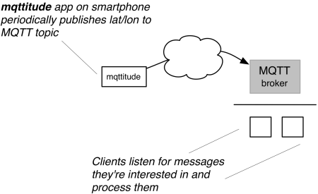

# MQTTitude

MQTTitude is an app (well, two apps actually) for Android and for iOS, which allow
a device to periodically publish its location status to an [MQTT] server. Think of
this as a _decentralized Google Latitude_, whereby the latter no longer exists. (This
actually was the reason this project was initiated.)

 

  [MQTT]: http://mqtt.org

