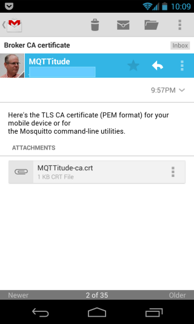
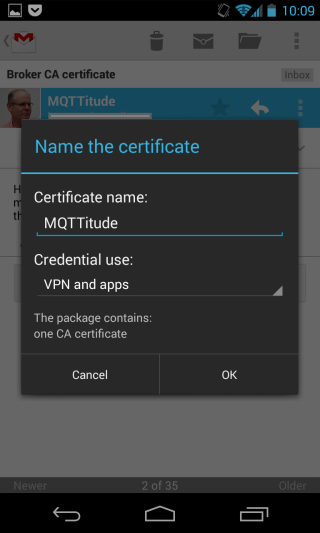
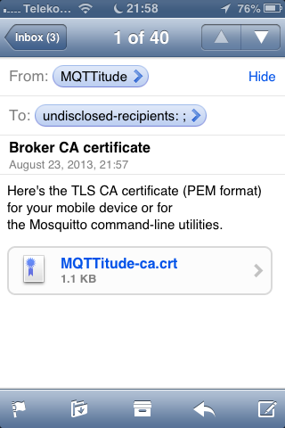
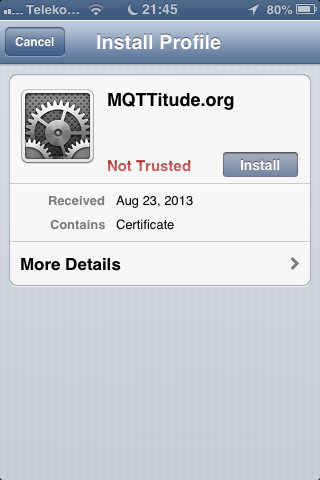
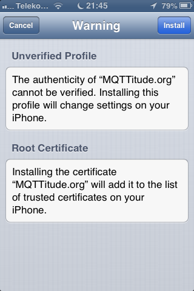
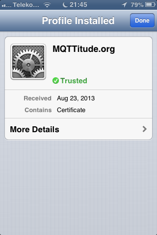

# Setting up TLS on your mobile device

You want data between your mobile device (a.k.a. smartphone) and the MQTT broker you use to be secured from eavesdropping. This is accomplished using [TLS] (the artist formerly known as SSL). When you configure your broker you will generate what is called a CA certificate which is basically a large amount of bits. The file you'll be creating in fact looks like this (in what is called [PEM] format; but you don't really want to know that, but if you do, see below for the nitty gritty).


You can share the cerficate if you want to (though not many people will want it ...)
It's so public, that it's perfectly OK to send yourself the file by, say, e-mail.

We show you here how to set up your iOS or Android device with that kind of certificate.

In both cases we assume you've got an e-mail in your inbox with the file you've sent yourself. This file has a `.crt` extension, and in both Android and iOS you can simply launch configuration by clicking on the attachment.

In our example, the CA certificate is called `MQTTitude-ca.crt`.

## Android

Note that by following these instructions on Android you'll be prompted to set a device PIN or pattern to protect the device. If you already have that, just carry on. If you absolutely don't want to do that, you should download the certificate into, say, the Downloads folder, and configure it manually in MQTTitude.

So, here's your e-mail message with said attachment.



Now click on the attached file, and you'll get the following dialog where you have to specify a name for the certificate (sigh: the certificate contains a name, but Android wants you to name it anyway). Give it any old name. We've chosen `MQTTitude`, of course. Then click OK.



That's it. You're done, and if you no longer require the certificate file just delete the e-mail, though we recommend you keep it around for a bit.


## iOS

So, here's your e-mail containing the certificate file. Click on it to launch the profile installer. No worries: we're not going to break anything. We're just adding yet another certificate to iOS' certificate store, and you're going to say that you trust that certificate. You ought to trust it: you've just created it yourself!



You've clicked, and here's the trust store. You see the certificate has a name, but it's not trusted yet. Click on Install.



Read the text. If you must. Just kidding: honestly, it's ok. But do read the text.



There you go! That's it: the certificate was installed.



You're done, and if you no longer require the certificate file just delete the e-mail, though we recommend you keep it around for a bit.

## The nitty gritty

That CA certificate file we mentioned? The attachment called `something.crt`? This is what it looks like:

```
-----BEGIN CERTIFICATE-----
MIIDGTCCAoKgAwIBAgIJAODXne2yV51zMA0GCSqGSIb3DQEBBQUAMGcxCzAJBgNV
BAYTAkRFMQwwCgYDVQQIEwNOUlcxETAPBgNVBAcTCElyZ2VuZHdvMRYwFAYDVQQK
...
pjGM/XgBs62UhqXnoHrHh/AHIiHieuNFwOhUg0fD/vQ5O6UZkJTWY5LLmEyPN5sS
cPZ5pT/WCvGuIOgNdy1VyWJrrlAjeQlbK+GDcNc=
-----END CERTIFICATE-----
```

That's plain text, even though it might be hard to believe. Actually, it's all sorts of magic wrapped into ASCII bytes, but we can look inside that, and we'll give you a sneak peak:

```
Certificate:
    Data:
        Version: 3 (0x2)
        Serial Number:
            e0:d7:9d:ed:b2:57:9d:73
        Signature Algorithm: sha1WithRSAEncryption
        Issuer: C=DE, ST=NRW, L=Irgendwo, O=MQTTitude.org/emailAddress=jjolie@example.com
        Validity
            Not Before: Aug 18 10:26:08 2013 GMT
            Not After : Aug 16 10:26:08 2023 GMT
        Subject: C=DE, ST=NRW, L=Irgendwo, O=MQTTitude.org/emailAddress=jjolie@example.com
        Subject Public Key Info:
            Public Key Algorithm: rsaEncryption
            RSA Public Key: (1024 bit)
                Modulus (1024 bit):
                    00:bd:70:b0:49:d4:17:c9:17:33:4d:74:fc:61:25:
                    ...
                Exponent: 65537 (0x10001)
        X509v3 extensions:
            X509v3 Subject Key Identifier: 
                4C:89:83:F0:33:AD:2B:D7:FD:DE:1D:6D:8D:00:52:C1:1C:75:B1:85
            X509v3 Authority Key Identifier: 
                keyid:4C:89:83:F0:33:AD:2B:D7:FD:DE:1D:6D:8D:00:52:C1:1C:75:B1:85
                DirName:/C=DE/ST=NRW/L=Irgendwo/O=MQTTitude.org/emailAddress=jjolie@example.com
                serial:E0:D7:9D:ED:B2:57:9D:73

            X509v3 Basic Constraints: 
                CA:TRUE
    Signature Algorithm: sha1WithRSAEncryption
        74:12:f8:d0:51:3a:c6:f8:62:75:61:d1:56:2f:bf:e3:64:3c:
        ...
```

Better, huh? Well, at least parts of it are now readable. Hope you liked this.


  [TLS]: http://en.wikipedia.org/wiki/Transport_Layer_Security
  [PEM]: http://en.wikipedia.org/wiki/Privacy_Enhanced_Mail
